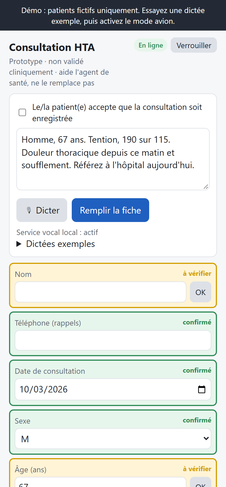
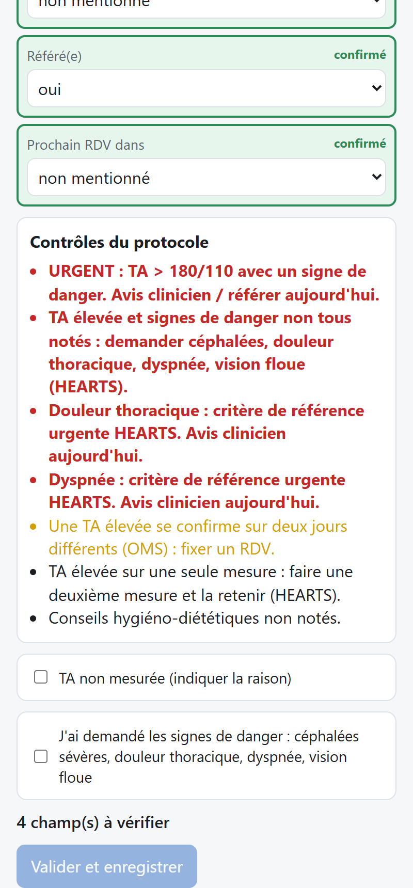

# HTN Visit Recorder: offline voice-to-record for hypertension care in rural Niger

**Live demo:** https://bixzare.github.io/Hack-nation-7th-Global-AI-Hackathon-WBG-Small-AI-Health/

A nurse dictates a short French note; small, offline AI turns it into a WHO-HEARTS-checked hypertension
record; the nurse approves it; and the patient hears her next visit announced in **Zarma**, by voice, the
evening before.

World Bank Group × Hack-Nation, *Small AI for Development*, Health. **Prototype, not clinically
validated. It supports health workers and does not replace them. All patients and all test voices are
synthetic.**

## Try it in 3 steps (about 2 minutes)
1. **Load a sample dictation.** Open the live demo, choose any 4-digit PIN, and open
   *Dictées exemples*. Pick a sample, for example *Homme 67 ans, TA très élevée*. Its transcript was
   precomputed by the offline speech model. Tap **Remplir la fiche** to fill the record. The URGENT
   flags appear at the top of *Contrôles du protocole*. Yellow fields marked *à vérifier* need a human
   check, and blood-pressure numbers from speech always do.
2. **Approve.** Type a name and a phone number, then tap **OK** on each yellow field. Tick the consent
   box and *J'ai demandé les signes de danger*. Then tap **Valider et enregistrer**. With a follow-up
   sample, the outbox shows a Zarma voice reminder (▶ Écouter) and a French SMS, both scheduled for
   18:30 the evening before the visit.
3. **Go offline.** Turn on airplane mode and reload the page. The app, your saved record, and the
   queued reminders are all still there; reminders wait until the network returns.

 

## The problem
The challenge describes Noor, who lives near an overcrowded clinic. Its clinicians struggle with heavy
record-keeping and outdated guidance. Her household shares one basic phone, which stays at home while
she works. We set her story in rural Niger:

- **Very few health workers:** about **3.1 doctors, nurses and midwives per 10,000 people** (WHO Global
  Health Observatory data, 2014–18, tabulated in [BMJ 2021, table 1](https://pmc.ncbi.nlm.nih.gov/articles/PMC7968446/table/tbl1)).
- **Common, rarely treated hypertension:** May Measurement Month 2017–19 screened 2,297 adults in
  Niger. **33.2% had hypertension, and only 3.4% of those were recorded as on treatment**, although
  medication data was often missing ([Eur Heart J Suppl 2022](https://pmc.ncbi.nlm.nih.gov/articles/PMC9547524/)).
  The earlier WHO STEPS survey (2007) found about **36%** with high blood pressure (as cited in the
  same paper).

The patient side is in Zarma, a less-supported language: there is no usable open speech recognition,
and written literacy is limited. So the tool uses AI where it is reliable (French, on the nurse's side)
and recorded human voice where it is not (Zarma, on the patient's side).

## How it works
```
nurse dictates (French)
  ─► Whisper small, offline on the health-centre laptop (127.0.0.1 only)
  ─► text
  ─► rule-based extractor in the browser (French lexicon, number words → digits, NegEx-style negation/uncertainty)
  ─► fixed hypertension record + confidence per field ("à vérifier" when unsure; speech numbers always)
  ─► WHO HEARTS / WHO 2021 rules (cited, deterministic): urgent / refer / gap flags
  ─► nurse confirms and approves (consent, danger signs asked, BP or "not measured" + reason)
  ─► saved in IndexedDB on the device
  ─► outbox: Zarma voice clips (intro + weekday + clinic) + French SMS, evening before the visit,
     store-and-forward
```

- **Why it is small AI:**
  - the phone side is a 1.7 MB static web app with a 38 KB engine;
  - extraction takes about 0.5 ms;
  - it works offline after the first load;
  - there are no cloud or AI API calls at runtime.
- **Speech** runs on the health centre's laptop, not on the phone.
- **Why AI and not just a form:** filling a form is the record-keeping burden. Earlier SMS tools such
  as Mwana and mTrac moved existing data. This tool creates the record from speech and checks it
  against the protocol.
- **Why rules for the clinical logic:** they are cited and checkable, and they cannot hallucinate.
  Every output is from a fixed list: fields, values, flags, SMS template, and voice clips.

## Results (frozen test split: 20 clips, never used for development)
| Input | Field accuracy (14 fields per clip) | Urgent cases flagged | False urgent | Danger signs present, detected | Present sign marked absent |
|---|---|---|---|---|---|
| Typed text (no speech recognition) | 271/280 (96.8%) | 5/5 | 0/15 | 11/11 | 0 |
| **Whisper small**, clean audio | **267/280 (95.4%)** | **5/5** | **0/15** | **11/11** (specificity 69/69) | **0** |
| Whisper small, noisy audio (9 clips, 10 dB SNR) | 116/126 (92.1%) | 3/3 | 0/6 | 6/6 | 0 |
| Whisper base (low-end fallback), clean | 246/280 (87.9%) | 4/5 | 2/15 | 10/11 | 0 |
| Whisper base, noisy | 100/126 (79.4%) | 2/3 | 0/6 | n/a | 0 |

| Model (laptop CPU, int8, 20 runs after warm-up) | Size | 9.9 s clip | Peak RAM | WER (test, clean / noisy) |
|---|---|---|---|---|
| **Whisper small** (demo) | 486 MB | 9.41 s median, 9.52 s p90 | ≈ 364 MB | 15.8% / 15.1% |
| Whisper base (fallback) | 148 MB | 3.27 s median, 3.58 s p90 | ≈ 140 MB | 18.2% / 31.4% |

**Caveats.**
- **Small sample:** only 20 test clips, with 5 urgent cases and 11 present danger signs, so the margins
  are wide.
- **Synthetic voices:** all test voices are synthetic.
- **Lexicon tuning:** part of the vocabulary was refined using aggregate error patterns. One headache
  pattern came from the separate development clips: Whisper hears "céphalées" as "c'est fallé". The
  full tuning history is in [`docs/log.md`](docs/log.md), so these numbers may be slightly optimistic.
- **Accuracy over speed:** we chose Whisper small because in health, catching urgent cases matters
  more than speed.
- **Classifier:** a 113 KB classifier was also trained, but it added nothing on the test set, because
  the remaining errors are in vocabulary coverage and speech recognition. The shipped extractor is
  rules-only.

Per-voice results: [`docs/results-test.md`](docs/results-test.md).

## Data
| Dataset | Use | Licence / terms | Size | Real or synthetic |
|---|---|---|---|---|
| French visit notes from templates (`ml/gen_synthetic.py`) | classifier training + dev | ours | 1,500 + 300 notes | **synthetic** |
| Gold set: 30 French dictations (3 male TTS voices: A = clips 1–10, B = 11–20, C = 21–30) + labelled CSV; script drafted with AI help, checked by the author | 10 dev / **20 test, frozen** | ElevenLabs output (paid plan) | 286 s | **synthetic** voices and patients |
| Noisy copies of 15 gold clips (fan, street, chatter; 10 dB SNR) | robustness test | ours | 139 s | **synthetic** |
| Zarma reminder clips (intro, 7 weekdays, clinic, refill) | patient reminders | ours | 10 clips, 0.8 MB | real voice, one speaker |
| Whisper small / base via faster-whisper | French speech recognition | MIT | 486 / 148 MB | pretrained |
| WHO HEARTS (2018), WHO hypertension guideline (2021) | rule thresholds | WHO | n/a | real |

Audio, gold labels and model files are not in this repo (`data/` and `models/` are gitignored), except
the 4 hosted samples.

**What our data does not cover:**
- **Real voices:** no real Nigerien-accented French speech was tested. All test audio is synthetic, and
  the next step is testing with health workers in Niger.
- **Female voices:** none in the French test audio.
- **Zarma speaker:** the reminders are recorded by one speaker. In real use, clinic staff would record
  them, so patients hear a voice they trust.
- **Zarma language:** there is no Zarma speech recognition, so the patient never speaks to the AI. No
  written Zarma is used, because of limited written literacy. The clips use French loanwords
  (*hôpital*, *médicament*) as everyday Zarma does.
- **Clinic conditions:** real clinic noise and real clinician phrasing are untested.
- **Visit types:** non-hypertension visits are out of scope.

## Safety and data handling
- **Never a diagnosis.** Outputs are triage actions: *urgent: ask a clinician or refer today*, *refer*,
  *take a second reading*. "No protocol gap found" explicitly says clinical judgement still applies.
- **A person always decides.** Nothing is saved until the nurse confirms every uncertain field,
  confirms consent, and confirms they asked about danger signs. That confirmation resolves the
  danger-sign flag but keeps it on the record with a timestamp.
- **BP can't be skipped silently.** Approval needs a value, or "not measured" with a recorded reason:
  device unavailable, patient refused, or other.
- **It fails safe.** Uncertain or low-confidence fields, and every number from speech, are marked
  *à vérifier*. If the extractor fails, the nurse gets an empty record with every field to check.
- **Data stays on the device.** Records are kept in the browser (IndexedDB). The hosted demo has no
  backend. The speech service listens only on 127.0.0.1 and logs nothing.
- **The PIN is a gate, not encryption.** Encrypting records at rest is a next step.
- **Shared phone.** The voice reminder and the SMS say only when and where to come, never why.

## Tech stack
- **Front end:** plain HTML and JavaScript (no framework), IndexedDB, a service worker, hosted on
  GitHub Pages.
- **Engine:** language-neutral JavaScript. Everything language- and country-specific lives in
  `lexicon/`, `locales/` and `profiles/`.
- **Speech:** faster-whisper (CTranslate2, int8), served by a small Python HTTP service on localhost.
- **Evaluation:** Node + Python scripts in `ml/`: field accuracy, WER, urgent-flag recall,
  sensitivity/specificity, latency, and a headless-Chrome end-to-end test.

## Run it locally
The web app needs no build step and no dependencies:
```
git clone https://github.com/Bixzare/Hack-nation-7th-Global-AI-Hackathon-WBG-Small-AI-Health.git
cd Hack-nation-7th-Global-AI-Hackathon-WBG-Small-AI-Health
python -m http.server 8080 -d app/web --bind 127.0.0.1
```
Open http://127.0.0.1:8080.

Live dictation is optional. It runs offline Whisper on this machine; the first run downloads 486 MB:
```
python -m venv .venv-speech
.venv-speech/Scripts/python -m pip install faster-whisper      # macOS/Linux: .venv-speech/bin/python
.venv-speech/Scripts/python -c "from faster_whisper import WhisperModel; WhisperModel('small', device='cpu', compute_type='int8', download_root='models/whisper')"
.venv-speech/Scripts/python speech/server.py --model small     # or --model base on weaker laptops
```
The *🎙 Dicter* button appears when the page is served from localhost and the service is running.

## Next steps
Ranked by cost, from our Small AI audit:
1. Time base and small on a typical low-cost health-centre laptop or tablet.
2. Ship the Whisper model with the install (the service already runs with `local_files_only`).
3. Price SMS and voice-call delivery per reminder with Niger operators (the gateway is simulated today).
4. Run speech on the phone itself with whisper.cpp tiny/base (32–60 MB), at lower accuracy.
5. Re-convert Whisper small to int8 on disk (about 250 MB).

Beyond these:
- test with real nurses' voices in Niger;
- encrypt records at rest;
- export to DHIS2;
- add protocol packs for diabetes and antenatal care, and voice packs for Hausa and Fulfulde.

## Credits
- **French test audio:** generated with ElevenLabs TTS (paid plan), synthetic voices.
- **Zarma reminder clips:** recorded by the team (one speaker).
- **Clinical rules:** WHO HEARTS technical package, *Evidence-based treatment protocols* (2018), and WHO
  *Guideline for the pharmacological treatment of hypertension in adults* (2021). See
  `app/web/engine/rules.js`.
- **Speech recognition:** OpenAI Whisper via faster-whisper (MIT).
- **Team:** Djibrilla Boubacar.

More: a narrative walkthrough is in [`Walkthrough.md`](Walkthrough.md), the decisions and metrics log
in [`docs/log.md`](docs/log.md), and the plan in [`docs/brief.md`](docs/brief.md).
